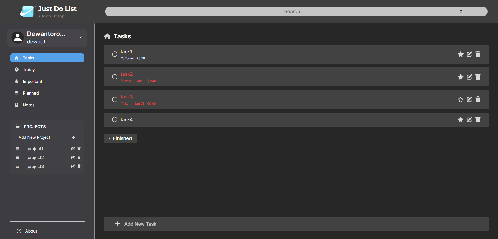
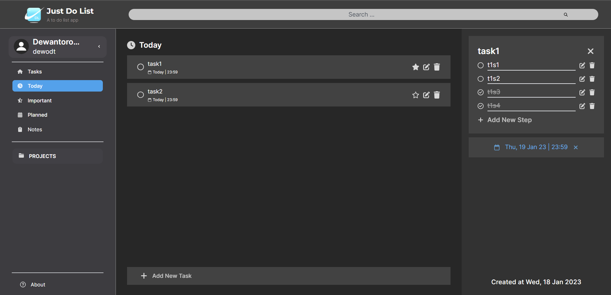
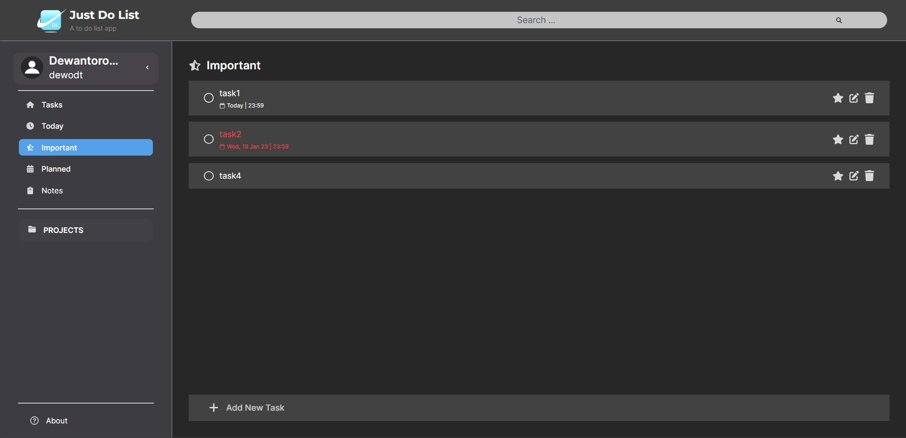
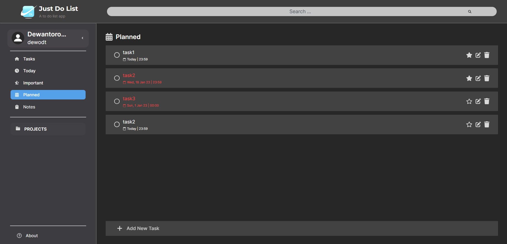
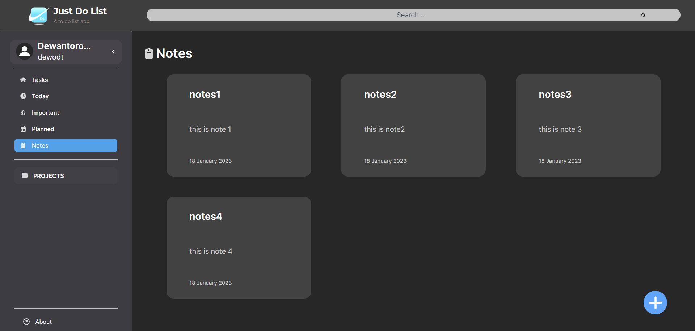
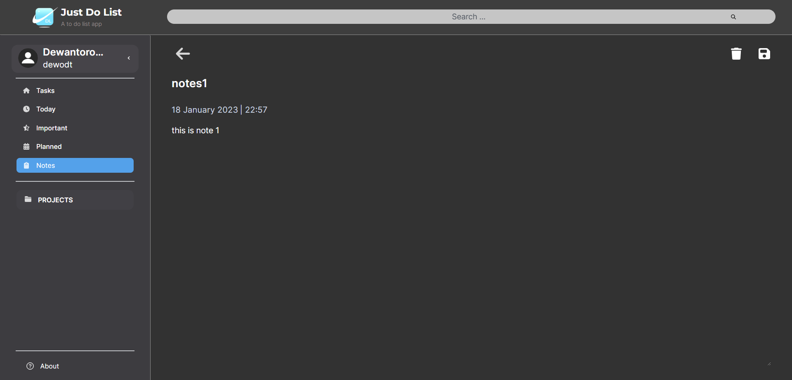
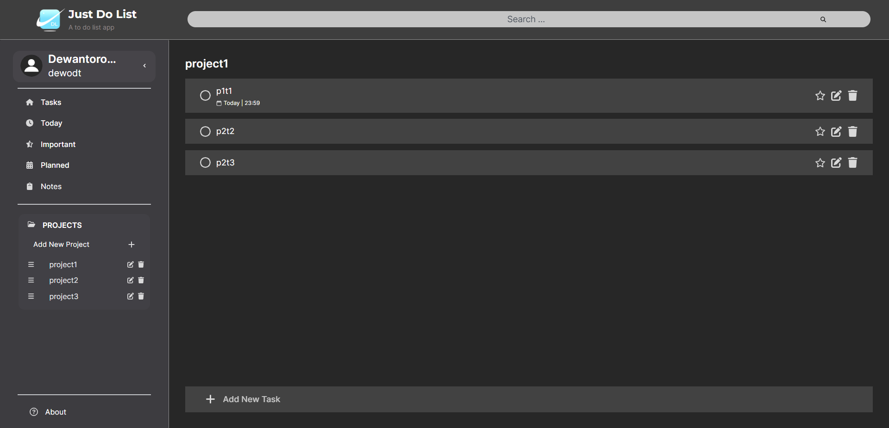
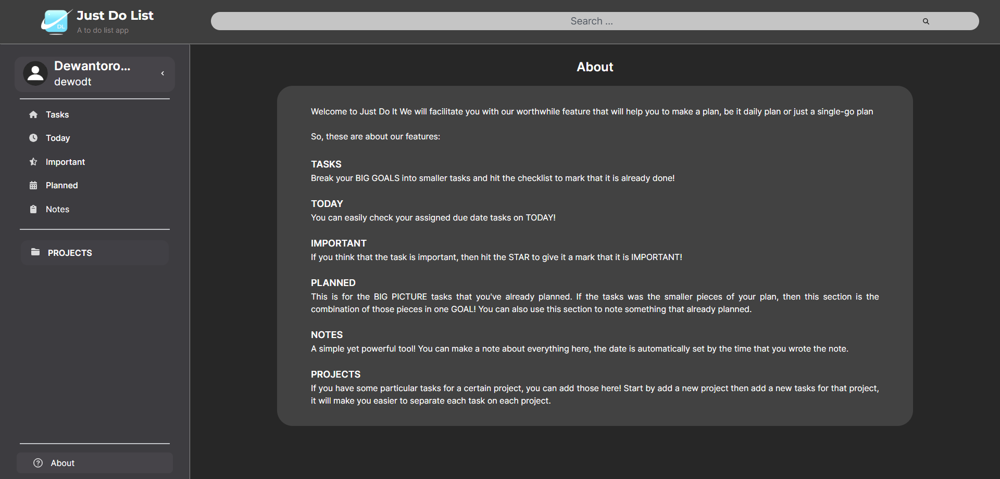

# App Description
Just Do List ✅ is a simple and user-friendly to-do list app that helps users stay organized and on top of their tasks. The app allows users to create and manage to-do lists with ease, making it the perfect tool for keeping track of daily tasks, long-term projects, and everything in between. Just Do List makes it easy to stay on top of your to-do lists and accomplish your goals!

# Tools Used
- NextJS (Frontend & Backend)
- TailwindCSS
- MongoDB for database (hosted in MongoDB Atlas)
- ect

# Frontend Description
- Pages:
  - ✅ Tasks: contains all of the task.

  - 📅 Today: contains all of the task that has a due date today's date.

  - ⭐ Important: contains all of the task that has been marked important.

  - 📅 Planned: contains all of the task that has a due date.

  - 🗒️ Notes: contains text notes.

  - ⌨️ Projects: contains all of the project with customizable title tasks.

  - ❔ About: contains the about page.

- Features:
  - 🔍 Search: to search a certain task in a page.

  - 📝 Edit: users can edit titles and descriptions.

  - 📅 Due date: add due date to a certain task.

  - ect.

# Backend Description
- 🔒 Login & Signup
  - If there is no cookie or cookie is not valid, then user can only access the login / signup page.

  - If the username is taken, then you can't use the username for signup.

  - Login using jsonwebtoken and Httponly Cookie that expires in 7 days signed with a secret key.

- 📝 Read/Write Database
  1. Create API endpoint with NextJS api route.

  2. Connect to MongoDB and read/write database.

  3. Close MongoDB.

# Run App
To use Just Do List, go to
[https://just-do-list.vercel.app/](https://just-do-list.vercel.app/).

# Task Allocation
- Dewantoro Triatmojo: Backend & Connect Backend with Frontend.

- Moh Fairuz Alauddin Yahya: Frontend

- Steven Tjhia: About page

# Screenshots

## ✅ Tasks Page

## 📅 Today Page

## ⭐ Important Page

## 📅 Planned Page

## 🗒️ Notes Page

## 📝 View While Editing Note

## ⌨️ Projects

## ❔ About

# Disclaimer
We think that the app is a bit laggy because we use free hosting, so please be patience. 🙏